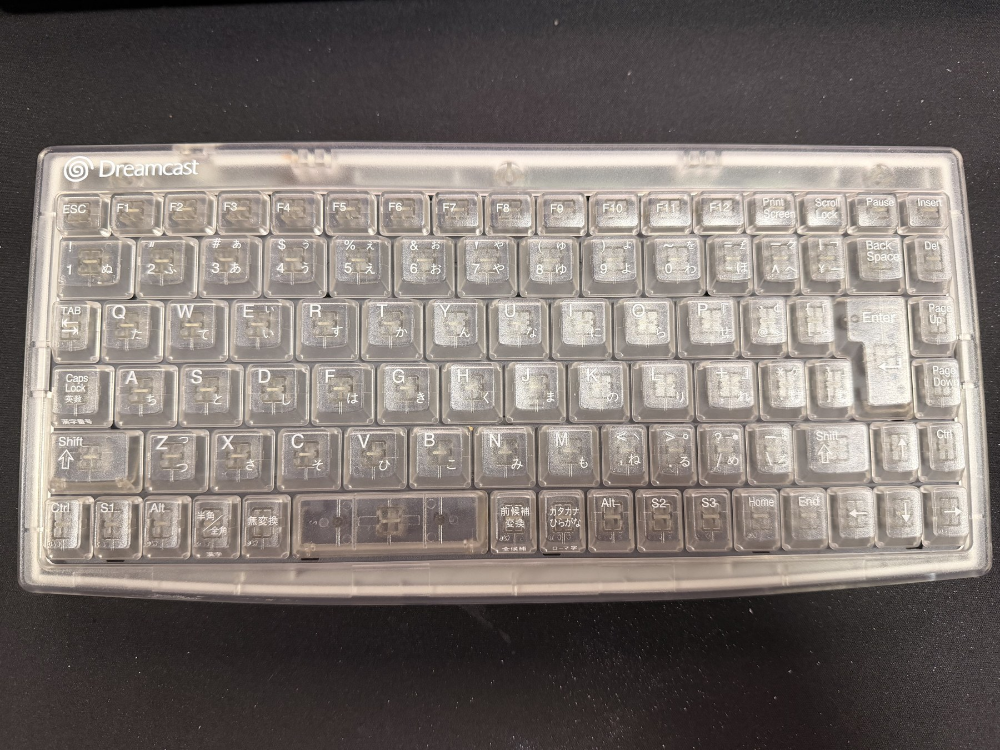
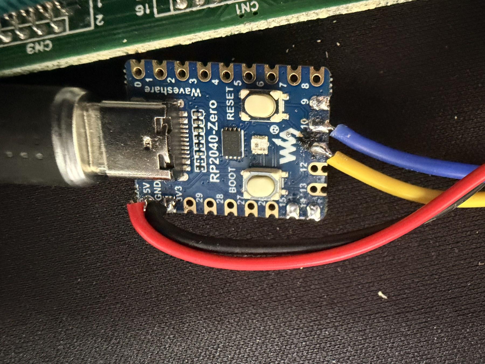
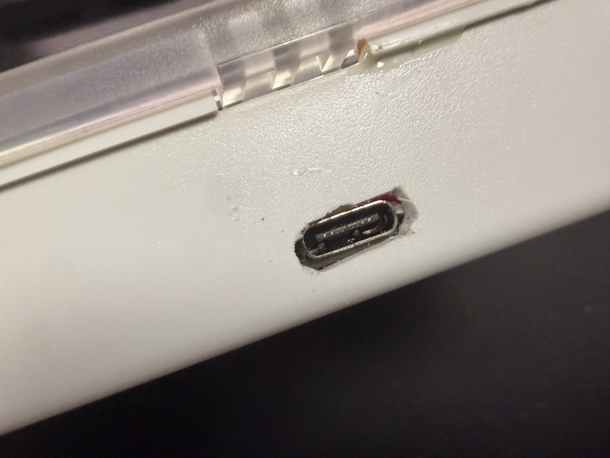
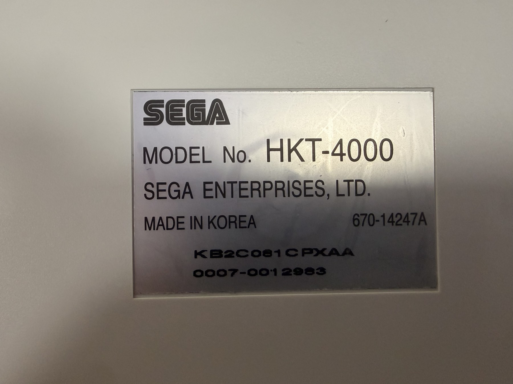

# Dreamcast HKT-4000 USB Keyboard Converter

English | [日本語](README.md)

Firmware that turns a Sega Dreamcast HKT-4000 keyboard into a standard USB HID
keyboard using a Raspberry Pi Pico or Waveshare RP2040-Zero.

The Waveshare RP2040-Zero build has been tested on real hardware with a Japanese
HKT-4000, including single keys, multiple simultaneous keys, and both Shift keys.

## Prebuilt UF2 files

| Board | File | Status |
|---|---|---|
| Waveshare RP2040-Zero | [dc_keyboard_usb_rp2040_zero.uf2](dist/dc_keyboard_usb_rp2040_zero.uf2) | Hardware tested |
| Raspberry Pi Pico | [dc_keyboard_usb.uf2](dist/dc_keyboard_usb.uf2) | Built |

SHA-256:

- RP2040-Zero: `2B23B1155E3EBF05543E92A401153011341636D98E3A28F8BD07A501A2D2E676`
- Pico: `4ECC4EC69D912EEF195321348F3373D8D4D309B468073DA1D19DD5F591C4AFF3`

## Hardware example

| HKT-4000 | RP2040-Zero wiring |
|---|---|
|  |  |
| USB-C port installation | Model label |
|  |  |

The photos show one implementation. Follow the connector pin numbers and signal
names below rather than relying on the colors of any intermediate wiring.

## Parts

- Raspberry Pi Pico or Waveshare RP2040-Zero
- Sega Dreamcast HKT-4000 keyboard
- Female end of a Dreamcast extension cable, or a compatible connector
- Two 33 ohm series resistors for SDCKA and SDCKB
- 0.1–0.25 A resettable fuse for 5 V protection (recommended)
- Hookup wire, prototyping board, and a data-capable USB cable
- Optional low-capacitance, 3.3 V-compatible ESD protection

## Wiring

Diagram: [English](docs/wiring-en.svg) / [日本語](docs/wiring.svg)

| Pin | HKT-4000 signal | Official cable color | Pico | RP2040-Zero | Notes |
|---:|---|---:|---|---|---|
| 1 | SDCKA | Red | GPIO10 (physical pin 14) | GP10 | 33 ohm series resistor |
| 2 | +5 V | Blue | VBUS (physical pin 40) | 5V | PTC fuse recommended |
| 3 | GND | Black | GND | GND | Connect to ground |
| 4 | Sense | Green | GND | GND | Also grounded inside the keyboard |
| 5 | SDCKB | White | GPIO11 (physical pin 15) | GP11 | 33 ohm series resistor |

> [!WARNING]
> Pins 1 and 5 appear reversed when the connector is viewed from the opposite
> side. Do not trust wire colors alone: verify continuity and pin numbers before
> applying power. Connecting +5 V to a GPIO or 3V3 pin can damage the board.

Maple uses 3.3 V signaling. GP10 and GP11 should idle at approximately 3.3 V due
to the RP2040's internal pull-ups. Do not power the keyboard from this adapter
while it is also connected to a Dreamcast console.

## Installing the UF2

1. Disconnect the board from the PC.
2. Hold BOOTSEL (BOOT on the RP2040-Zero) while connecting the USB cable.
3. Copy the UF2 matching your board to the `RPI-RP2` drive.
4. After the automatic reboot, confirm that “Dreamcast HKT-4000 Keyboard” appears.
5. Connect the HKT-4000 and test it in a text editor.

The RP2040-Zero's onboard WS2812 RGB LED is not used as a status indicator.

## Key behavior

- Dreamcast key codes are forwarded as USB HID key codes.
- S1 and S2 become the left and right GUI (Windows/Command) keys.
- S3 becomes the Application/Menu key.
- For Japanese-specific keys, select a Japanese 106/109 layout in the OS.
- Host Num/Caps/Scroll Lock LED state is not sent back to the HKT-4000.
- Up to six normal keys plus modifiers can be reported simultaneously.

## Building

Use Pico SDK 2.3.x and an ARM GCC toolchain. The first configure downloads a
pinned [DreamPicoPort](https://github.com/OrangeFox86/DreamPicoPort) commit and
therefore requires an internet connection.

```sh
git clone --branch 2.3.0 https://github.com/raspberrypi/pico-sdk.git
git -C pico-sdk submodule update --init --recursive
export PICO_SDK_PATH="$PWD/pico-sdk"

# Raspberry Pi Pico
cmake -S . -B build -DPICO_BOARD=pico -DCMAKE_BUILD_TYPE=Release
cmake --build build -j

# Waveshare RP2040-Zero
cmake -S . -B build-zero -DPICO_BOARD=waveshare_rp2040_zero -DCMAKE_BUILD_TYPE=Release
cmake --build build-zero -j
```

Outputs:

- `build/dc_keyboard_usb.uf2`
- `build-zero/dc_keyboard_usb_rp2040_zero.uf2`

## Troubleshooting

See the [English troubleshooting guide](docs/troubleshooting.en.md).

## How it works

RP2040 PIO drives the Maple bus on GPIO10/11. At startup the firmware enumerates
the HKT-4000 with a Maple Device Info Request, then polls the keyboard every 8 ms
and converts its condition data into an 8-byte USB HID boot-keyboard report. If
responses stop for more than 100 ms, all keys are released and enumeration is
restarted.

## License

This project is released under the [MIT License](LICENSE). The Maple transport
uses MIT-licensed DreamPicoPort code; see
[THIRD_PARTY_NOTICES.md](THIRD_PARTY_NOTICES.md).

## References

- [Waveshare RP2040-Zero](https://www.waveshare.com/wiki/RP2040-Zero)
- [Maple bus protocol](https://dreamcast.wiki/Maple_bus)
- [Dreamcast keyboard condition/key codes](https://mc.pp.se/dc/kbd.html)
- [KallistiOS keyboard definitions](https://kos-docs.dreamcast.wiki/keyboard_8h_source.html)
- [Raspberry Pi Pico SDK](https://github.com/raspberrypi/pico-sdk)
- [DreamPicoPort](https://github.com/OrangeFox86/DreamPicoPort)
